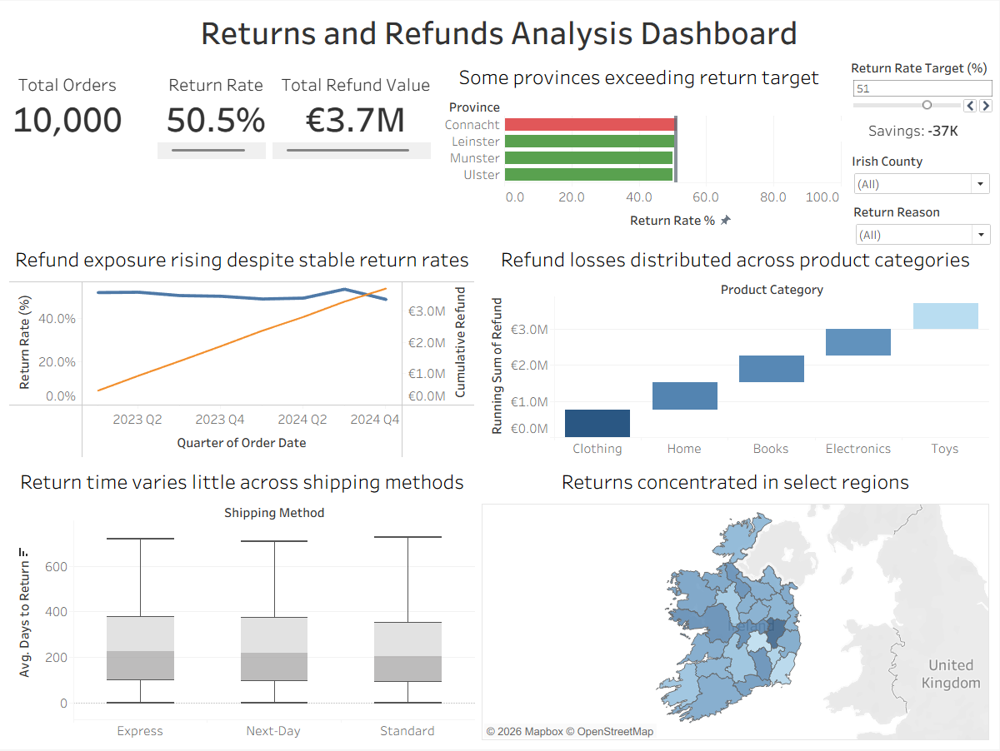

# Returns & Refunds Analysis Dashboard

## Overview

This project analyzes returns and refund behavior for an eCommerce business using a Tableau dashboard built on 10,000 orders across Ireland (2023–2024).

The objective was to identify key drivers of high return rates and quantify their financial impact.

---

## Business Problem

The company is experiencing a high return rate, leading to significant revenue loss.
This dashboard was designed to answer:

* Where are returns happening?
* Which products and regions contribute most?
* Is the problem improving over time?
* What operational actions can reduce refunds?

---

## Dashboard Preview

---

## Key Insights

* **Return Rate is critically high (~50%)**, meaning 1 in 2 orders are returned
* **Refund exposure is continuously increasing**, with no recovery trend
* **Returns are evenly distributed across categories**, indicating a systemic issue
* **Clothing and Electronics show slightly higher return rates**, making them priority areas
* **Certain regions (e.g., Kildare, Connacht) consistently exceed the average return rate**
* **Return timelines vary significantly**, suggesting inefficiencies in the return process

---

## Recommendations

* Introduce **pre-shipment quality checks** for high-return categories
* Investigate **regional drivers of returns** via targeted customer feedback
* Improve **returns process efficiency**, especially for Standard shipping
* Set a **target return rate (e.g., 40%)** and monitor performance using the dashboard

---

## Tools Used

* Tableau (Dashboard design & visualization)
* Excel / CSV (Data preparation)

---

## Files
* `Refunds_Trend_Dashboard.twbx` – Tableau workbook
* `data/returns_cleaned_data.csv` – cleaned dataset
* `images/dashboard_overview.png` – dashboard screenshot

---

## Key Takeaway

This project demonstrates how data visualization can be used to move from raw data to actionable business insights and decision-making.
